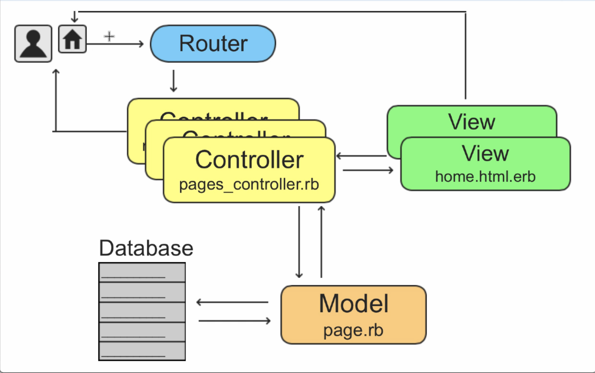

# Ruby

## NOTES

- Is more of an object oriented language
- Access interactive ruby shell `irb`
- [Ruby style guide](https://github.com/rubocop/ruby-style-guide#readme)

## SYNTAX

- `#` This is for commenting

- `puts` Will print out the argument that you give it to the console, built in function in ruby, will also return
  `nil`:

- `p` This function returns whatever argument that you give it

- `print` also does the same as p but won't return to a new line, so add `"Hello World \n"` to break to a new line [\n]

- `greeting = "Hello world"` - variable in ruby, we assign a value to it

- `" "` ruby only uses double quotes for string interpolation

- `anyVariable.class = string | number | etc` Will define type of a var, everything in ruby is a class

- `anyVariable.methods` Will display all the methods that can be used on this variable given its type

- `100.to_s = "100"` This method will convert a number into a string

- `100.to_s.class` Is referred to as method chaining

- `anyVar.empty?` - Returns a boolean

- `"".nil returns false` - Everything in ruby has a some type of value, best to use `.empty?` when doing comparisons

- `name = "My name is Tom"` We can use a method called .sub(`currentValue`,`newValue`) with strings that replaces the currentValue with a newValue i.e `name.sub("Tom", "Alex")`

- `gets.chomp` Gets user input, and always returns a string, so when passing in number always remember to convert the number into a number, because if you don't it will convert the number into a string and concatenate it with any value passed to it. Use this 👉🏽 `5.to_i`

## STRINGS

- To start irb console:
  `irb`

- To exit the console:
  `exit`

- String concat structure:
  `String1 + String2`
  `String1 + " " + String2 + String3`

- To find out what class the object belongs to:
  `Variable_name.class`

- `1.class` # This will return integer, signifying that 1 is of type integer

- String interpolation (remember has to be within double quotes):
  `name = "Mashrur"`
  `"My name is #{name}"`

* This will print out the value of name in the line "My name is...."

- To escape the evaluation of `#{variablename}` within a String, prepend with a `\:`
  `\#{variablename}`

- To get input from the command line use the following method:
  `gets.chomp`

- To assign the input to a variable so it can be referenced later on:
  `variablename = gets.chomp`

## ARRAYS

- `puts` logs values of an array by iterating each value as a string so it returns a new line

- `print` will log values of an array but won't return a new line, so then add puts right underneath to fix that

- `p` will do both, print value and return a new line on logging value

- `x = 1..100`, will print values from 1 to 100, we can however use array methods like `x.to_a` which will add all these values to an array, plus you can use method chaining `x.to_a.shuffle`,(this will shuffle an array)

- `x.reverse` mutates the array but `x.reverse!` mutates the caller, this means that when we try to log `x` later on it will stay reversed

- `x = "a".."z"` will create values from a to z, you can add `x.to_a` will add them in an array

- `x << 5` will add a new element to the array

- `x.first` will get first element of the array and `x.last` will get last element

- `x.unshift("Ali")` will add first element to an array

- `x.append("Ali)` will add element element at the end of the array

- `x.uniq!` will check the array and remove duplicate values in an array, mutates the caller

- `x.empty?` check if array is empty

- `a.include?("Lee")` returns boolean to check if array includes element

- `a.push("new item")` adds new element to the array, mutates the original array

- `a.pop("item")` removes last item in an array and returns new item added

- `a.join` joins all elements into a string, to separate them use `a.join("-")`, doesn't mutate the original array

- `a.split("-")` splits a string from a specific element and returns array

- `%w("This is not an array")` will get values passed in and split them into individual elements and return an array, mutates the original array

- `z = _`

## Hash

- In ruby when extracting value from key in a hash we use bracket notation `obj["property"]`

- `:a` are referred to as symbols, these are like keys in objects, you can get the value for this symbol by `obj[:a]`, this will return a value of `a` in the object

- `.is_a?` is a condition that checks if something you're checking for is true or false

- To find out methods available to an object:
  `objectname.methods`

- Some methods that can be used on objects:
  `objectname.nil?`
  `objectname.empty?`
  `objectname.length`
  `objectname.reverse`

- A Hash includes the `Enumerable` module, which provides several iteration methods, such as: `Enumerable#each`, `Enumerable#each_pair`, `Enumerable#each_key`, and `Enumerable#each_value`.

## Object Oriented Programming

- Encapsulation - concept of blocking off areas of code and not making it available to the rest of the program

- Inheritance - is used where a class inherits the behavior of another class, referred to as the superclass

- Polymorphism - is when a class inherits the behaviors of another class, but has the ability to not inherit everything and change some of it’s inherited behaviors. For example to write a method that does something differently from the inherited method

- In ruby we use a `class`, this is a blue print that is used to create an object

- When you work with an attribute of an obj, work with an instance of that class, that is an instance variable, we add `@` to each attribute
  `@first_name`
  `@last_name`

- Hex representation of a class `#<Course:0x000000010afd2630>` classes by default have a default method `to_s`,

- To access and declare values to in a class we use the `getters` and `setters` method, `setter` adds a value (`anyVar.f_name ="door"`) and `getter` gets the attribute value (`anyVar.f_name`), this is good but is not effective as there will be redundancy incase the class gets bigger, so ruby provides us the functionality to use an `attr_accessor `

- Hashing algorithm for authentication in ruby [check this doc for more info](https://www.rubydoc.info/gems/bcrypt-ruby/)

- bcrypt provides method to turn string into hashed

## MODEL VIEW CONTROLLER (MVC)

- Creates separation of presentation layer (what the user of the application sees in the browser/mobile device) and the business-logic or back-end (invinsible layer) 

- General flow of Rails application:
  - Request made at browser
  - Request received at router of rails application
  - Request routed to appropriate action in a controller
  - `Controller#action` either renders a view template or communicates with model
  - Model communicates with database
  - Model sends back information to controller
  - Controller renders view

  ### Model
  - `User -> Post -> Article -> Stock`
  - Require persistance or database (different tables for each model)
  - In rails Models are used to communicate with the tables in the application

  ### View
  - `home | new | friends | about_me`
  - This is what the user sees in the application
  - Visible layer of the app
  - Comprises of html/css/javascript
  - To use ruby code, rails uses embedded ruby i.e (home.html.erb)

  ### Controller
  - `users_controller` - `blogs_controller`
  - controllers are brains of application
  - logic is written here and user requests

### GENERATE A VIEW
- `rails server` starts server
- `rails generate controller pages` generates a new controller will files associated with it

## CONVENTIONAL EXPECTATIONS

- Define a route that points to a controller#action
- Have an appropriately names controller, for example: if dealing with layouts or static pages of the application, a name could pages_controller
- Have an appropriately named action, for example: if dealing with homepage, the action/method could be named home
- If done this way, under views, rails will expect a pages folder (named for the pages controller) and a home.html.erb template
<p align="center"> 

</p>

## Root route, controller and more MVC - Text directions and references

- To set a root route, navigate to config/routes.rb file and enter in the following code ->
`root 'pages#home'`

- In order to preview the application, you will need to start the rails server. You can start the server by navigating to the terminal and typing in the following command from your application directory followed by enter/return:
`rails server`

- You can also type `rails s` for short. Once the server starts you can open up a browser window and type in localhost:3000 to preview the app. If you are using `AWS cloud9`, (rfSCT14)

- Back to the app, in order for the code to work there will need to be a pages controller and a home action within it.

- Create a pages controller by navigating to the terminal/command line and typing in the following command from your application directory:
`rails generate controller pages`

- There should now be a pages_controller.rb file under app/controllers folder.

- Open up this file and add the home action to it with a rendering of 'Hello World!' like below:

```
def home
  render html: 'Hello World!'
end
```

- Once you save this file and reload the browser preview, Hello World! should be displayed in the browser.

- In order to do this the conventional way using views remove the code within the home action and leave it as an empty method/action like below:
```
def home
end
```
- This will expect a home.html.erb template under the pages folder under views. This pages folder under the views folder was created when the pages controller was generated.

Within this app/views/pages folder, create a new file called home.html.erb and add in the following code inside the file:
`Hello World!`

- Once you save this file and preview it from the browser, it should still say Hello World! as expected.